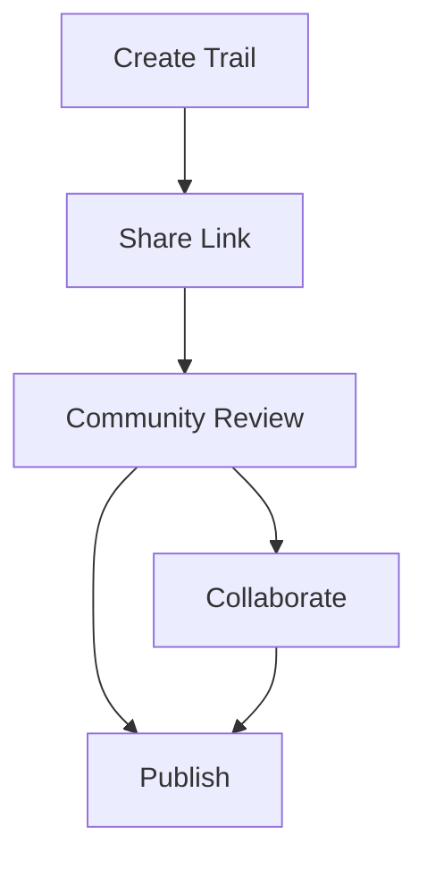

## Overview

Fynd empowers you to create detailed trail documentation with intuitive tools. You build interactive maps, track routes via GPS, add rich media, rate trail difficulty, and collaborate with the community. These features streamline documentation from exploration to sharing.

<Columns cols={3}>
  <Card title="Interactive Mapping" icon="map" href="#interactive-mapping">
    Create dynamic trail maps with elevation profiles.
  </Card>
  <Card title="GPS Tracking" icon="navigation" href="#gps-integration">
    Record precise routes in real-time.
  </Card>
  <Card title="Multimedia Support" icon="image" href="#multimedia">
    Embed photos and videos for vivid documentation.
  </Card>
  <Card title="Difficulty Ratings" icon="gauge" href="#ratings">
    Assign safety and skill levels systematically.
  </Card>
  <Card title="Community Features" icon="users" href="#community">
    Share, review, and co-edit trails collaboratively.
  </Card>
</Columns>

## Interactive Trail Mapping Tools

You start mapping trails directly in Fynd's editor. Draw paths, add waypoints, and generate elevation charts automatically.

<Steps>
  <Step title="Create New Map" icon="map-pin">
    Open the mapping tool and select your trailhead location, such as `37.7749, -122.4194` for San Francisco trails.
  </Step>
  <Step title="Draw Route" icon="edit-3">
    Click to add points along the trail. Fynd auto-smooths the path.
  </Step>
  <Step title="Add Details" icon="info">
    Insert elevation data and landmarks.
  </Step>
</Steps>

```javascript
// Example: Embed map via Fynd SDK
import { FyndMap } from '@fynd/trail-sdk';

const map = new FyndMap({
  trailId: 'everest-base-camp',
  container: document.getElementById('map'),
  apiKey: 'YOUR_API_KEY'
});
map.render();
```

## GPS Integration for Route Tracking

Integrate GPS devices or mobile apps to capture accurate routes. Fynd processes GPX files or live streams for seamless import.

<Tabs>
  <Tab title="GPX Upload" icon="upload">
    Upload your GPX file:
    
````xml
<gpx version="1.1">
  <trk>
    <trkseg>
      <trkpt lat="37.7749" lon="-122.4194"><ele>10</ele></trkpt>
      <trkpt lat="37.7750" lon="-122.4200"><ele>15</ele></trkpt>
    </trkseg>
  </trk>
</gpx>
````
  </Tab>
  <Tab title="Live Tracking" icon="radio">
    Connect via API for real-time updates.
    
    <CodeGroup tabs="JavaScript,cURL">
```javascript
const response = await fetch('https://api.example.com/trails/live-track', {
  method: 'POST',
  headers: { 'Authorization': 'Bearer YOUR_TOKEN' },
  body: JSON.stringify({ lat: 37.7749, lon: -122.4194 })
});
```
```bash
curl -X POST https://api.example.com/trails/live-track \
  -H "Authorization: Bearer YOUR_TOKEN" \
  -d '{"lat":37.7749,"lon":-122.4194}'
```
    </CodeGroup>
  </Tab>
</Tabs>

## Multimedia Support for Photos and Videos

Enhance documentation with media. Upload photos of scenic views or videos of tricky sections.

<Callout kind="tip">
  Optimize images to `<1MB` for faster loading. Use geotags for automatic placement on maps.
</Callout>

| Media Type | Supported Formats | Max Size |
|------------|------------------|----------|
| Photos     | JPEG, PNG       | 5MB     |
| Videos     | MP4, MOV        | 50MB    |

## Trail Difficulty and Safety Ratings

Assign ratings to inform hikers. Categories include beginner, intermediate, expert, with safety flags for hazards.

<ParamField path="difficulty" param-type="string" required="true">
  Values: `easy`, `moderate`, `hard`, `expert`.
</ParamField>

<ParamField path="hazards" param-type="array" required="false">
  Array of strings like `["steep-drop", "wildlife"]`.
</ParamField>

## Community Collaboration Features

Share trails publicly or invite collaborators. Users comment, edit, and rate submissions.



<Expandable title="Advanced Collaboration" default-open="false">
  Use webhooks for notifications:
  
  <Request show-lines="true">
```javascript
POST https://api.example.com/trails/{id}/collaborators
Authorization: Bearer YOUR_TOKEN
{
  "userId": "user123",
  "role": "editor"
}
```
  </Request>
</Expandable>

<Callout kind="success">
  Start with [Interactive Trail Mapping](#interactive-mapping) to explore Fynd's core strength.
</Callout>