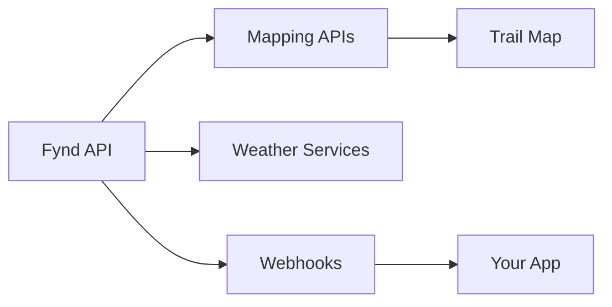

## Overview

Integrate Fynd with external services to enrich your trail documentation. Pull in live mapping data, weather forecasts, or automate updates via webhooks. Export trails to PDF or sync with partner apps for seamless workflows.

<Callout kind="info">
  All integrations use the Fynd API at `https://api.fynd.com/v1`. Obtain your `{API_KEY}` from the dashboard.
</Callout>

## Key Integrations

Use these popular integrations to extend Fynd's capabilities.

<Columns cols={3}>
  <Card title="Mapping APIs" icon="map" href="#mapping">
    Embed interactive maps from Google Maps or OpenStreetMap.
  </Card>
  <Card title="Weather Services" icon="cloud-rain" href="#weather">
    Sync real-time weather for trail safety.
  </Card>
  <Card title="Webhooks" icon="zap" href="#webhooks">
    Receive instant notifications on trail updates.
  </Card>
</Columns>

## Mapping APIs

Connect Fynd trails to mapping providers for dynamic visualizations.

<Tabs>
  <Tab title="Google Maps" icon="map-pin">
    Add Google Maps integration via API.

    <Steps>
      <Step title="Get API Key" icon="key">
        Create a key at [Google Cloud Console](https://console.cloud.google.com).
      </Step>
      <Step title="Configure Fynd" icon="settings">
        Update your trail document:

````javascript
// In your trail config
const trailConfig = {
  maps: {
    provider: "google",
    apiKey: "YOUR_GOOGLE_API_KEY"
  }
};
````

      </Step>
      <Step title="Embed Map" icon="globe">
        Render the map in your documentation.
      </Step>
    </Steps>
  </Tab>
  <Tab title="OpenStreetMap" icon="map">
    Use free OSM tiles.

    ```javascript
    const trailConfig = {
      maps: {
        provider: "osm",
        url: "https://tile.openstreetmap.org/{z}/{x}/{y}.png"
      }
    };
    ```
  </Tab>
</Tabs>

## Weather Services

Sync weather data to display forecasts on trails.

```javascript
// Fetch weather for a trail location
async function getTrailWeather(lat, lng, apiKey) {
  const response = await fetch(
    `https://api.openweathermap.org/data/2.5/weather?lat=${lat}&lon=${lng}&appid=${apiKey}`
  );
  return response.json();
}
```

<ParamField query="lat" param-type="number" required="true">
  Trail latitude (`> -90`, `<90`).
</ParamField>

<ParamField query="lng" param-type="number" required="true">
  Trail longitude (`> -180`, `<180`).
</ParamField>

## Webhooks for Real-Time Updates

Set up webhooks to notify external services on trail changes.

### Setup Steps

<Steps>
  <Step title="Create Webhook" icon="plus">
    In dashboard, add endpoint: `https://your-webhook-url.com/fynd`.
  </Step>
  <Step title="Verify Events" icon="check-circle">
    Subscribe to `trail.updated` or `trail.created`.
  </Step>
  <Step title="Handle Payload" icon="code">
    Process incoming data.
  </Step>
</Steps>

<CodeGroup tabs="Node.js,Python">
````javascript
// Node.js webhook handler
app.post('/fynd-webhook', (req, res) => {
  const { event, data } = req.body;
  if (event === 'trail.updated') {
    console.log(`Trail ${data.id} updated: ${data.name}`);
  }
  res.status(200).send('OK');
});
````
````python
# Python webhook handler
from flask import Flask, request

app = Flask(__name__)

@app.route('/fynd-webhook', methods=['POST'])
def webhook():
    data = request.json
    if data['event'] == 'trail.updated':
        print(f"Trail {data['data']['id']} updated: {data['data']['name']}")
    return 'OK', 200
````
</CodeGroup>

<ResponseField name="event" field-type="string">
  Event type like `trail.updated`.
</ResponseField>

<ResponseField name="data" field-type="object">
  Trail details.
</ResponseField>

## Exporting Data

Export trails to PDF or integrate with apps like Zapier.

```bash
# CLI export example
fynd export trails --format=pdf --output=trails.pdf
```

<Expandable title="Advanced Export Options" default-open="false">
  Use `--filter=active` for active trails only.
</Expandable>

## Third-Party Partnerships

Partner apps extend Fynd:

| Partner | Category | Link |
|---------|----------|------|
| Zapier | Automation | [zapier.com/fynd](https://zapier.com) |
| Strava | Fitness | [strava.com/integrations](https://strava.com) |
| AllTrails | Discovery | [alltrails.com/partners](https://alltrails.com) |



<Callout kind="tip">
  Start with webhooks for custom automations. Check [Fynd Dashboard](https://dashboard.fynd.com/integrations) for more.
</Callout>